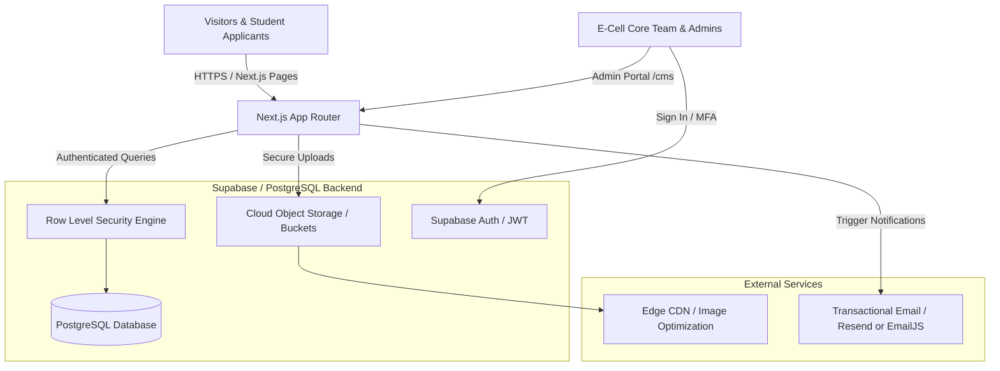
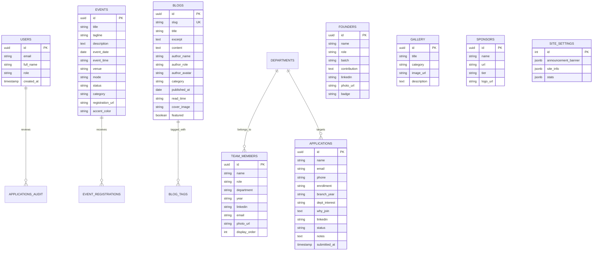
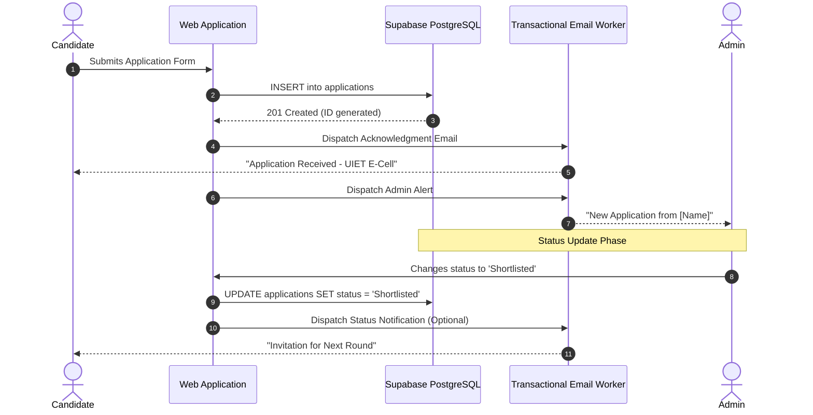

# UIET E-Cell — Comprehensive Backend Architecture & Blueprint

This document specifies the complete architectural blueprint and engineering specification for the backend of the **UIET E-Cell Platform** (Maharshi Dayanand University, Rohtak).

---

## 1. System Topology & Architecture Overview

The system is designed with a decoupled, high-performance architecture supporting both **Next.js Server Actions / API Routes** and direct **Supabase PostgreSQL with Row Level Security (RLS)**.



---

## 2. Entity-Relationship Data Model

The domain consists of 9 core entities handling content management, applications, media, and site configuration:



---

## 3. Database Schema Specification (PostgreSQL DDL)

Execute the following SQL schema in your PostgreSQL / Supabase SQL Editor:

```sql
-- 1. Enable UUID Extension
CREATE EXTENSION IF NOT EXISTS "uuid-ossp";

-- 2. Enums
CREATE TYPE application_status AS ENUM ('Pending', 'Shortlisted', 'Accepted', 'Rejected');
CREATE TYPE event_status AS ENUM ('upcoming', 'past');
CREATE TYPE user_role AS ENUM ('super_admin', 'admin', 'editor');

-- 3. Applications Table (Student Recruitment)
CREATE TABLE public.applications (
    id UUID PRIMARY KEY DEFAULT uuid_generate_v4(),
    name VARCHAR(255) NOT NULL,
    email VARCHAR(255) NOT NULL,
    phone VARCHAR(20) NOT NULL,
    enrollment VARCHAR(100),
    branch_year VARCHAR(100) NOT NULL,
    dept_interest VARCHAR(100) NOT NULL,
    why_join TEXT NOT NULL,
    linkedin VARCHAR(500),
    status application_status DEFAULT 'Pending' NOT NULL,
    notes TEXT,
    created_at TIMESTAMPTZ DEFAULT NOW() NOT NULL,
    updated_at TIMESTAMPTZ DEFAULT NOW() NOT NULL
);

CREATE INDEX idx_applications_status ON public.applications(status);
CREATE INDEX idx_applications_email ON public.applications(email);

-- 4. Application Audit Log Table
CREATE TABLE public.application_logs (
    id UUID PRIMARY KEY DEFAULT uuid_generate_v4(),
    application_id UUID REFERENCES public.applications(id) ON DELETE CASCADE,
    previous_status application_status,
    new_status application_status NOT NULL,
    changed_by VARCHAR(255) NOT NULL,
    note TEXT,
    created_at TIMESTAMPTZ DEFAULT NOW() NOT NULL
);

-- 5. Events Table
CREATE TABLE public.events (
    id UUID PRIMARY KEY DEFAULT uuid_generate_v4(),
    title VARCHAR(255) NOT NULL,
    tagline VARCHAR(500),
    description TEXT,
    event_date DATE NOT NULL,
    event_time VARCHAR(50),
    venue VARCHAR(255),
    mode VARCHAR(50) DEFAULT 'Offline',
    status event_status DEFAULT 'upcoming' NOT NULL,
    tags TEXT[] DEFAULT '{}',
    registration_url VARCHAR(500),
    accent_color VARCHAR(50) DEFAULT '#0047FF',
    category VARCHAR(100) DEFAULT 'General',
    created_at TIMESTAMPTZ DEFAULT NOW() NOT NULL,
    updated_at TIMESTAMPTZ DEFAULT NOW() NOT NULL
);

CREATE INDEX idx_events_date ON public.events(event_date DESC);
CREATE INDEX idx_events_status ON public.events(status);

-- 6. Blog Posts Table
CREATE TABLE public.blogs (
    id UUID PRIMARY KEY DEFAULT uuid_generate_v4(),
    slug VARCHAR(255) UNIQUE NOT NULL,
    title VARCHAR(500) NOT NULL,
    excerpt TEXT NOT NULL,
    content TEXT NOT NULL,
    author_name VARCHAR(255) NOT NULL,
    author_role VARCHAR(255) DEFAULT 'UIET Team',
    author_avatar VARCHAR(500),
    category VARCHAR(100) NOT NULL,
    published_at DATE DEFAULT CURRENT_DATE NOT NULL,
    read_time VARCHAR(50) DEFAULT '5 min read',
    cover_image VARCHAR(500) NOT NULL,
    featured BOOLEAN DEFAULT FALSE NOT NULL,
    tags TEXT[] DEFAULT '{}',
    created_at TIMESTAMPTZ DEFAULT NOW() NOT NULL,
    updated_at TIMESTAMPTZ DEFAULT NOW() NOT NULL
);

CREATE INDEX idx_blogs_slug ON public.blogs(slug);
CREATE INDEX idx_blogs_featured ON public.blogs(featured);
CREATE INDEX idx_blogs_category ON public.blogs(category);

-- 7. Team Members Table
CREATE TABLE public.team_members (
    id UUID PRIMARY KEY DEFAULT uuid_generate_v4(),
    name VARCHAR(255) NOT NULL,
    role VARCHAR(255) NOT NULL,
    department VARCHAR(100) NOT NULL,
    year VARCHAR(50),
    linkedin VARCHAR(500),
    email VARCHAR(255),
    photo_url VARCHAR(500),
    display_order INT DEFAULT 0 NOT NULL,
    created_at TIMESTAMPTZ DEFAULT NOW() NOT NULL
);

CREATE INDEX idx_team_order ON public.team_members(display_order ASC);

-- 8. Founders Table
CREATE TABLE public.founders (
    id UUID PRIMARY KEY DEFAULT uuid_generate_v4(),
    name VARCHAR(255) NOT NULL,
    role VARCHAR(255) NOT NULL,
    batch VARCHAR(50),
    contribution TEXT,
    linkedin VARCHAR(500),
    photo_url VARCHAR(500),
    badge VARCHAR(100),
    created_at TIMESTAMPTZ DEFAULT NOW() NOT NULL
);

-- 9. Gallery Items Table
CREATE TABLE public.gallery (
    id UUID PRIMARY KEY DEFAULT uuid_generate_v4(),
    title VARCHAR(255) NOT NULL,
    category VARCHAR(100) NOT NULL,
    image_url VARCHAR(500) NOT NULL,
    description TEXT,
    created_at TIMESTAMPTZ DEFAULT NOW() NOT NULL
);

-- 10. Sponsors / Partners Table
CREATE TABLE public.sponsors (
    id UUID PRIMARY KEY DEFAULT uuid_generate_v4(),
    name VARCHAR(255) NOT NULL,
    url VARCHAR(500),
    tier VARCHAR(50) DEFAULT 'Partner',
    logo_url VARCHAR(500),
    created_at TIMESTAMPTZ DEFAULT NOW() NOT NULL
);

-- 11. Site Settings & Stats Table (Singleton)
CREATE TABLE public.site_settings (
    id INT PRIMARY KEY DEFAULT 1,
    announcement_banner JSONB DEFAULT '{"enabled": false, "text": "", "linkText": "", "linkUrl": ""}'::jsonb,
    site_info JSONB DEFAULT '{"email": "ecell@mdurohtak.ac.in", "phone": "+91 99999 99999", "address": "UIET, MDU Rohtak, Haryana"}'::jsonb,
    stats JSONB DEFAULT '{"members": 30, "events": 12, "startups": 5, "years": 3}'::jsonb,
    updated_at TIMESTAMPTZ DEFAULT NOW() NOT NULL
);

-- Guarantee singleton row
INSERT INTO public.site_settings (id) VALUES (1) ON CONFLICT (id) DO NOTHING;
```

---

## 4. Security & Access Control (Row Level Security)

PostgreSQL RLS ensures that public visitors can read published content and submit applications, while only authenticated administrative staff can perform mutations or read applicant data.

```sql
-- Enable RLS on all tables
ALTER TABLE public.applications ENABLE ROW LEVEL SECURITY;
ALTER TABLE public.application_logs ENABLE ROW LEVEL SECURITY;
ALTER TABLE public.events ENABLE ROW LEVEL SECURITY;
ALTER TABLE public.blogs ENABLE ROW LEVEL SECURITY;
ALTER TABLE public.team_members ENABLE ROW LEVEL SECURITY;
ALTER TABLE public.founders ENABLE ROW LEVEL SECURITY;
ALTER TABLE public.gallery ENABLE ROW LEVEL SECURITY;
ALTER TABLE public.sponsors ENABLE ROW LEVEL SECURITY;
ALTER TABLE public.site_settings ENABLE ROW LEVEL SECURITY;

-- 1. Applications: Anyone can submit; only authenticated admins can view & edit
CREATE POLICY "Public can submit applications"
    ON public.applications FOR INSERT
    WITH CHECK (true);

CREATE POLICY "Admins can view and manage applications"
    ON public.applications FOR ALL
    TO authenticated
    USING (true);

-- 2. Public Read Policies for content tables
CREATE POLICY "Public read events" ON public.events FOR SELECT USING (true);
CREATE POLICY "Public read blogs" ON public.blogs FOR SELECT USING (true);
CREATE POLICY "Public read team" ON public.team_members FOR SELECT USING (true);
CREATE POLICY "Public read founders" ON public.founders FOR SELECT USING (true);
CREATE POLICY "Public read gallery" ON public.gallery FOR SELECT USING (true);
CREATE POLICY "Public read sponsors" ON public.sponsors FOR SELECT USING (true);
CREATE POLICY "Public read settings" ON public.site_settings FOR SELECT USING (true);

-- 3. Admin Full Access on content tables
CREATE POLICY "Admin manage events" ON public.events FOR ALL TO authenticated USING (true);
CREATE POLICY "Admin manage blogs" ON public.blogs FOR ALL TO authenticated USING (true);
CREATE POLICY "Admin manage team" ON public.team_members FOR ALL TO authenticated USING (true);
CREATE POLICY "Admin manage founders" ON public.founders FOR ALL TO authenticated USING (true);
CREATE POLICY "Admin manage gallery" ON public.gallery FOR ALL TO authenticated USING (true);
CREATE POLICY "Admin manage sponsors" ON public.sponsors FOR ALL TO authenticated USING (true);
CREATE POLICY "Admin manage settings" ON public.site_settings FOR ALL TO authenticated USING (true);
```

---

## 5. REST API & Endpoint Contracts

| Endpoint | Method | Access | Purpose | Payload / Parameters |
| :--- | :--- | :--- | :--- | :--- |
| `/api/applications` | `POST` | Public | Submit new student application | `{ name, email, phone, branchYear, deptInterest, whyJoin, linkedin }` |
| `/api/applications` | `GET` | Admin | Retrieve filtered candidates list | `?status=Shortlisted&search=query` |
| `/api/applications/:id` | `PATCH` | Admin | Update candidate status or notes | `{ status: "Accepted", notes: "Interview done" }` |
| `/api/events` | `GET` | Public | Get all upcoming & past events | `?status=upcoming` |
| `/api/events` | `POST` | Admin | Create new event listing | Event schema |
| `/api/events/:id` | `PUT / DELETE` | Admin | Modify or remove event | Event schema / ID |
| `/api/blogs` | `GET` | Public | Get blog listing with filters | `?category=Startups&search=pitch` |
| `/api/blogs/:slug` | `GET` | Public | Fetch article detail by slug | URL param `slug` |
| `/api/blogs` | `POST` | Admin | Publish new article | BlogPost schema |
| `/api/blogs/:id` | `PUT / DELETE` | Admin | Edit or delete article | BlogPost schema / ID |
| `/api/team` | `GET` | Public | Fetch active student team list | — |
| `/api/team` | `POST / PUT` | Admin | Add or reorder team members | Member schema |
| `/api/gallery/upload` | `POST` | Admin | Upload event photos to storage | `multipart/form-data` |
| `/api/settings` | `GET` | Public | Fetch announcement & contact info | — |
| `/api/settings` | `PUT` | Admin | Update site banner, info, or stats | SiteSettings schema |
| `/api/export/csv` | `GET` | Admin | Export application records to CSV | `?status=all` |

---

## 6. Storage Bucket Configurations

To manage gallery photos, event covers, team avatars, and founder pictures, establish the following bucket configuration in Supabase Storage or AWS S3:

| Bucket Name | Privacy | Allowed MIME Types | Max Size | CDN Path |
| :--- | :--- | :--- | :--- | :--- |
| `gallery` | Public | `image/png`, `image/jpeg`, `image/webp` | 5 MB | `/storage/v1/object/public/gallery/` |
| `blog-covers` | Public | `image/png`, `image/jpeg`, `image/webp` | 4 MB | `/storage/v1/object/public/blog-covers/` |
| `team-photos` | Public | `image/png`, `image/jpeg`, `image/webp` | 2 MB | `/storage/v1/object/public/team-photos/` |
| `resumes` | Private (Admin Only) | `application/pdf` | 10 MB | Authenticated signed URLs |

---

## 7. Email & Transactional Notifications Flow

When a candidate submits an application or their status changes:



---

## 8. Backend Implementation Roadmap

1. **Phase 1: Database Initialization**
   - Run the provided DDL schema in Supabase / PostgreSQL.
   - Configure Row Level Security (RLS) rules and verify public vs admin access.

2. **Phase 2: Authentication & RBAC**
   - Connect Supabase Auth with email/password and session cookie tokens.
   - Configure role-based checks for `/admin/*` server actions.

3. **Phase 3: Client Sync & API Layer**
   - Replace the local mock data in `context/DataProvider.tsx` with live database calls via the `@supabase/supabase-js` client.
   - Implement real-time subscriptions for incoming applications and live stats.

4. **Phase 4: Media Upload Pipeline**
   - Create drag-and-drop file uploaders in `BlogsManager`, `TeamManager`, and `GalleryManager` that save directly to Supabase Storage buckets.
